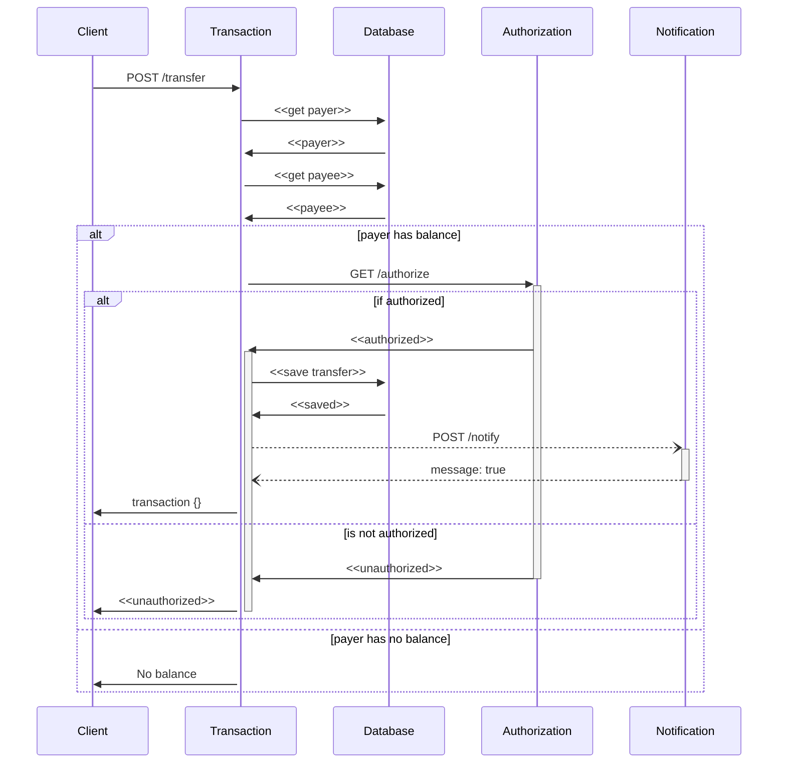

# Challenge PicPay

This code was implemented using the [PicPay Challenge](https://github.com/PicPay/picpay-desafio-backend).

> Do not use this code in production.

## Sequence Diagram

```mermaid
sequenceDiagram
    participant Client
    participant Transaction
    participant Database
    participant Authorization
    participant Notification
    
    Client->>Transaction: POST /transfer
    Transaction->>+Database: <<get payer>>
    Database->>+Transaction: <<payer>>
    Transaction->>+Database: <<get payee>>
    Database->>+Transaction: <<payee>>
    alt payer has balance
        Transaction->>+Authorization: GET /authorize
        alt if authorized
            Authorization->>+Transaction: <<authorized>>
            Transaction->>Database: <<save transfer>>
            Database->>Transaction: <<saved>>
            Transaction--)+Notification: POST /notify
            Notification--)-Transaction: message: true
            Transaction->>Client: transaction {}
        else is not authorized
            Authorization->>-Transaction: <<unauthorized>>
            Transaction->>-Client: <<unauthorized>>
        end
    else payer has no balance
        Transaction->>Client: No balance
    end
```